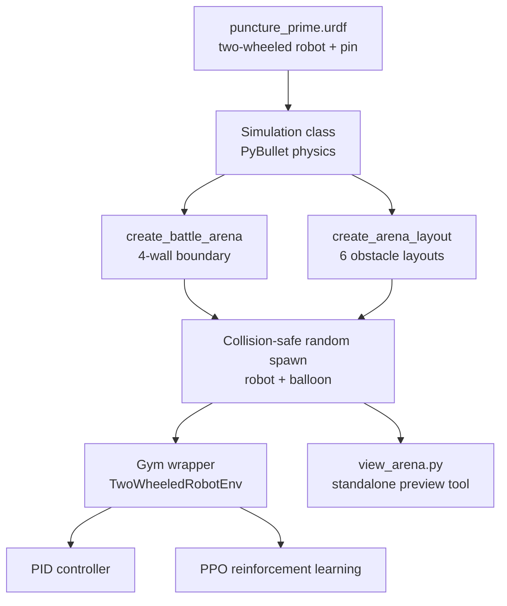

# Two-Wheeled Robot Battle Arena Simulation (PyBullet + Reinforcement Learning)

A physics-based simulation built with PyBullet for training a two-wheeled robot to navigate configurable arenas and disable a target ("pop the balloon"), using both classical control (PID) and reinforcement learning (PPO via Stable-Baselines3 + Gymnasium). Built as part of a student robotics project at Breda University of Applied Sciences.

> Original team repo: `BredaUniversityADSAI/combat_robotics` (BUas student org, private). This repository is my personal portfolio copy, reorganized and documented to showcase my contribution.

## Overview

The project simulates a two-wheeled robot fitted with a "pin" end-effector, trained to reach and pop a target balloon inside a bounded arena. The base simulation, robot model, and a Gym-compatible training environment were built collaboratively by the team; on top of that I designed and built the **battle arena system** — the part of the codebase responsible for the environment the robot is actually trained and tested in.

**My role:** I built the configurable battle-arena environment: an enclosed wall boundary, six selectable obstacle layouts, collision-safe randomized spawning for both the robot and the target, and a standalone arena-preview tool. The underlying robot model, Gym wrapper, and PID baseline controller were built by teammates — my contribution is the environment layer all of that runs on top of.

**Team:** combat_robotics — a multi-contributor BUas student project; battle arena system by Asma Moghimi.

## Architecture



## My Contribution: The Battle Arena System

- **`create_battle_arena()`** — encloses the arena in four walls (built from PyBullet box colliders), replacing the original open floor so the robot can no longer drive off the edge.
- **`create_arena_layout()`** — six selectable arena types: `empty`, `offset_boxes`, `cross`, `corridor`, `corners`, and `mixed` (a combination of box and cylinder obstacles), selected via `Simulation(arena_type=...)`.
- **Collision-safe randomized spawning** — `get_random_robot_spawn()` and `get_random_balloon_position()` pick a random position each episode reset while checking distance against every obstacle center, so training episodes never start inside a wall or obstacle.
- **`view_arena.py`** — a standalone script that opens a render window with a fixed debug camera to visually inspect any arena layout, without needing to run a full training loop.

This turns the simulation from a single fixed empty room into a small, extensible suite of test environments — useful both for curriculum-style RL training (easy → hard arenas) and for sanity-checking new robot behaviors before a long training run.

## Base Simulation (team-built, what my arena work runs on)

- **Robot model** (`puncture_prime.urdf`) — a two-wheeled robot with differential drive and a forward-facing "pin" link used to detect contact with the balloon.
- **Gym environment** (`gym_wrapper.py`, `TwoWheeledRobotEnv`) — action space is left/right wheel velocity; observation space is robot (x, y, yaw) plus target (x, y); reward combines heading alignment toward the target with progress (distance closed since the last step).
- **PID baseline** (`pid.py`) — a classical, non-learned controller that drives the robot toward the target using separate yaw and distance PID loops, useful as a sanity check against the RL policy.
- **RL training option** — PPO via Stable-Baselines3, trained directly against the Gym wrapper.

## Tech Stack

`Python` · `PyBullet` · `Gymnasium` · `Stable-Baselines3` (PPO) · `simple-pid` · `NumPy`

## Repository Structure

```
.
├── README.md
├── requirements.txt
├── puncture_prime.urdf            # robot model (team-built)
├── simulation.py                  # Simulation class: physics, arena, spawning (my arena work lives here)
├── gym_wrapper.py                 # Gym environment wrapper (team-built)
├── pid.py                         # PID baseline controller (team-built)
├── view_arena.py                  # standalone arena preview tool (my contribution)
└── test_agent.py                  # Gym wrapper smoke test
```

## Running It

```bash
python -m venv venv && source venv/bin/activate
pip install -r requirements.txt

# Preview an arena layout
python view_arena.py   # edit arena_type inside the script: empty, offset_boxes, cross, corridor, corners, mixed

# Run the PID baseline
python pid.py

# Train an RL policy (PPO)
python - <<'EOF'
from stable_baselines3 import PPO
from stable_baselines3.common.monitor import Monitor
from gym_wrapper import TwoWheeledRobotEnv

env = Monitor(TwoWheeledRobotEnv())
model = PPO("MlpPolicy", env, verbose=1, learning_rate=3e-4, n_steps=2048, batch_size=64, gamma=0.99, gae_lambda=0.95, ent_coef=0.01)
model.learn(total_timesteps=1_000_000, progress_bar=True)
model.save("model.zip")
EOF
```

## Limitations

- The current task ("pop the balloon") is a simplified stand-in for combat-robot behavior, not a full multi-robot combat simulation yet.
- The reward function in the Gym wrapper rewards distance/orientation progress but doesn't yet penalize collisions with arena obstacles directly — an obstacle-aware reward term would be a natural next step.
- No trained model checkpoint is included in this repo; training is left to the user via the script above.

## Acknowledgments

Built as part of a multi-person student robotics project at Breda University of Applied Sciences. Each team member developed and tested their contribution on individual branches before merging into the shared simulation.
